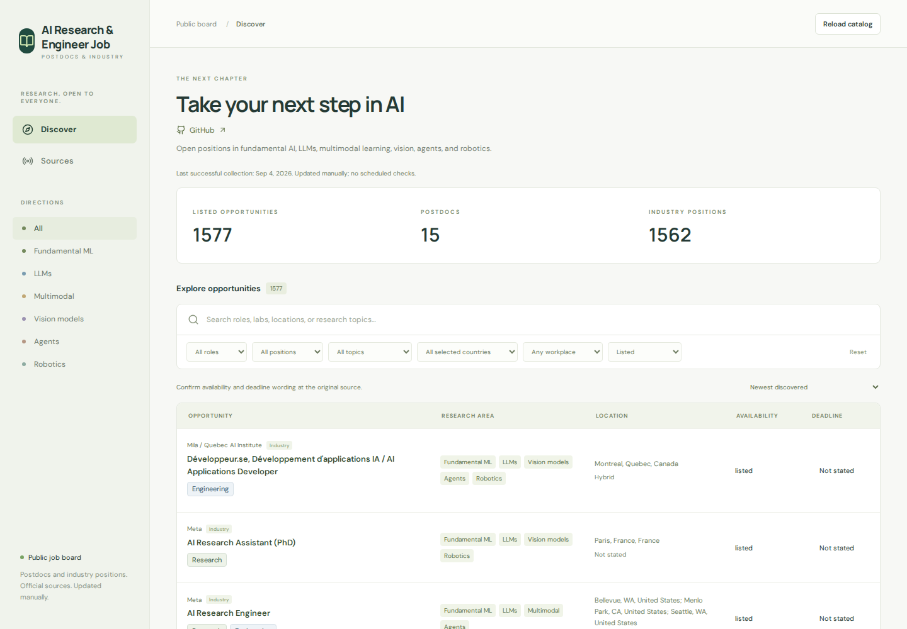

# AI Research & Engineer Job

**Take your next step in AI.** Discover postdoctoral and industry opportunities
across AI research and engineering, with searchable listings and links to the
original employers.

### [Open the job board →](https://ageyy.github.io/ai-career-tracker-public/)

No account is needed to browse. Applications are made through the original
posting, not through this website.

*Public website screenshot captured September 5, 2026 (UTC). Listings and counts may
change after an update.*

## What you can find

- **Topics:** fundamental machine learning, large language models, multimodal AI,
  computer vision, agents, and robotics software.
- **Roles:** postdoctoral positions, research scientists, research engineers,
  AI/ML engineers, and related software roles. Research and Engineering labels
  are separate from the Postdoc/Industry categories; some jobs carry both labels.
- **Locations:** selected employers and postings in the United States, Canada,
  United Kingdom, France, Japan, Germany, and China.

Coverage is selective, not exhaustive. Internships and hardware-focused roles are
outside this board's scope. A company's inclusion does not mean every opening at
that company is listed.

## How to use it

1. **Search and filter.** Search by employer, job title, or keywords. Combine
   direction, role type, Research/Engineering, and country filters.
   Use **All** in the sidebar to clear the direction, or
   **Reset** to clear the filters.
2. **Choose your ordering.** Sort by newest discovered, deadline, organization,
   or **Early-career relevance (PhD / postdoc)**. Early-career ordering uses
   posting text to prioritize postdocs, new-PhD roles, and lower experience
   requirements; it is an estimate, not an eligibility guarantee.
3. **Read a posting.** Click a job for concise sections covering the role,
   responsibilities, qualifications, and other available details. Follow
   **View original posting** to confirm the full requirements and apply.
4. **Check Sources.** See participating employers, source health and check
   dates, plus recruitment and startup-discovery resources. Some sources are
   reference links rather than connected feeds; a discovery link is not a vacancy.
5. **Keep your place.** Use **Mark applied** or **Ignore** on a job to move it out
   of Discover. Open **Applied** or **Ignored** in the sidebar to see saved jobs;
   **Recover** removes that status. Marking applied does not submit an application.

## Your saved history

Without an account, job decisions and saved posting copies stay in your browser;
they are not uploaded. No account history is published to this repository or
shared with other visitors. Saved copies remain accessible
even when a posting leaves the catalog. Recovering an absent posting does not
reopen it or recreate it in the live catalog.

No account is needed for this local history. It does not sync across browsers,
devices, domains, or preview ports. Clearing site data (or closing a private-browsing
session) can erase it. Anyone with access to your browser profile can read it.
Browser storage is shared by sites on the same origin; it is not account-level
access control.

When account login is enabled, **Sign in / Register** in the upper-right corner
offers email/password login. Signup requires an email verification code; ordinary
login does not. **Forgot password?** sends a recovery code to set a new password.
Existing passwordless users can use it to set their first password. **My account**
contains the account controls. Signed-in Applied/Ignored decisions sync through a private Supabase database.
Use **Refresh saved jobs** to fetch changes from another device; syncing also runs
when opening or returning to the board. Account saving requires a connection.
Existing browser history is imported only after you confirm; existing account
decisions win, and browser copies stay unchanged. Signing out restores that separate
browser history. You can export account history or permanently delete the account.
Authorized service administrators can access stored account data. Sign out on
shared devices; browser sessions are not isolated from other scripts on the same
origin. If login is not configured, browser-only saving remains available.

## Updates and reliability

**Updates run weekly, normally Monday at 13:17 UTC, not in real time.** The updater
discovers employers, verifies official feeds, and publishes only after validation.
It makes inclusion decisions without requiring visitor review. Schedules can be
delayed and some sources may be unavailable. Reloading reads the latest published
catalog; it does not start a new search of job sites.

- **Newest discovered** means when the board first found a role, not necessarily
  when the employer published it.
- **Listed** means the role appeared in the source when checked. It does not
  guarantee the opening is still available today.
- Failed checks retain previous records and verification dates. Review source
  health and older-snapshot warnings before relying on a listing.
- Recruitment resources and general postdoc admissions pages may have no
  catalog records; that does not mean the institution has no opportunities.

Always confirm availability, application deadlines, degree-completion requirements,
location, and work authorization with the original employer. This board does not
submit applications, contact recruiters, or guarantee eligibility.

## About this repository

This repository contains the **generated public website and public job catalog**,
not the application's development source. Visitors' saved history and
candidate-specific ranking data are never included in these files. Files are
replaced by the publishing process, so direct code edits here are not the way to
change the application.
